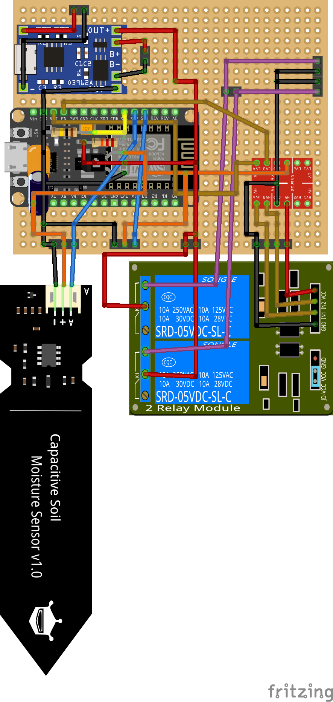

# HomePlantery

[Plantwatery](https://github.com/Lumics/Plantwatery) but with ESPHome (based on [ESPlanty](https://community.home-assistant.io/t/esplanty-self-watering-solar-powered-plant-no-plumbing-no-powerpoints-irrigation-deep-sleep-battery/464263))

# Hardware
- [ESP32 WSROOM](https://www.amazon.com/ESP-WROOM-32-Development-Microcontroller-Integrated-Compatible/dp/B08D5ZD528/ref=sr_1_3?dib=eyJ2IjoiMSJ9.is-SH_RLGHiZZUrqvTWU_G47m1VG_nJcewwyvxGB7OvCY988in8VrBtNhYYw93kqu-TzbQ7iGPAVwtLR4hIciAc1UbAKsX5YxXF5BrMKtY6tger2LwgrmCYPu-hvVMluE9alMexKdAq--0biDqqz1dQUUKAOFdmFcM649BSEBodAk-NyjGVKNRgqKQrteMe9z18b0mE2ql9UzHJYwFRyEWR5CzEjfUauRxMdGvZB4WM.qr_nt2kP2eFUJDdUv6sq-4Srn7YnFFWOma_bYg2G_XE&dib_tag=se&keywords=esp32+wroom&qid=1720358463&sr=8-3)
- [Capacity Soil Moisture Sensor](https://de.aliexpress.com/item/32892951369.html?spm=a2g0o.order_list.order_list_main.42.bb595c5f6tNArW&gatewayAdapt=glo2deu)(2 slots available)
- [1 Channel 5V Relay Board](https://de.aliexpress.com/item/1005005626475953.html?spm=a2g0o.order_list.order_list_main.36.bb595c5f6tNArW&gatewayAdapt=glo2deu)
- [MCP1700 3.3v Voltage Regulator](https://www.aliexpress.com/item/1005001608339185.html?spm=a2g0o.order_list.order_list_main.24.bb595c5f6tNArW&gatewayAdapt=glo2deu)
- [5V 1.2W (at least 0.5W) Solar Panel](https://de.aliexpress.com/item/1005004198199771.html?spm=a2g0o.order_list.order_list_main.72.bb595c5f6tNArW&gatewayAdapt=glo2deu)
- [5V 2.4W Decdeal Water Pump](https://www.amazon.de/dp/B07B49VKJH?psc=1&ref=ppx_yo2ov_dt_b_product_details)
- [Pneumatic Tube 6mm](https://www.aliexpress.com/item/4000859747207.html?spm=a2g0o.order_list.order_list_main.11.bb595c5f6tNArW)
- [Pneumatic Tube T Connector 6mm outer diameter](https://de.aliexpress.com/item/1005003985521367.html?spm=a2g0o.order_list.order_list_main.48.bb595c5f6tNArW&gatewayAdapt=glo2deu)
- [Pneumatic Tube End Connector 6mm outer diameter](https://www.aliexpress.com/item/4001338085412.html?spm=a2g0o.order_list.order_list_main.12.bb595c5f6tNArW)
- Slide Switch
- Water Canister (e.g. [Plastic Box 12 litres](https://www.hornbach.de/p/kunststoffbox-dirk-xs-12-l-255x170x370-mm/8493487/))
- M3 (4-9mm long) Screws for mounting

__Note: My Hardware setup in theory allows to connect 2 moisture sensors and 2 water pumps, but only 1 each is used as of now.__

## Schematic

[Fritzing Schematic](./doc/schematic_perfboard.fzz)

# Software

## Requirements
- [Home Assistant](https://www.home-assistant.io/)
- [ESPHome integration](https://www.home-assistant.io/integrations/esphome/)
- Create [Input Boolean Helper integration](https://www.home-assistant.io/integrations/input_boolean/) with id `input_boolean.ota_update_available`

## Code
[plant_watering_control.yaml](./homeassistant/plant_watering_control.yaml):

1. Checks if there are OTA Updates available (toggle in HA), if there are updates, prevent deep sleep
2. Reset sensors and take measurements (median with sliding window, notification with sensor values)
3. Start watering if moisture is below threshold (notification for water pump start and stop action)
4. Re-measure moisture change (notification if moisture didn't rise as expected)
5. Enter deep-sleep until configured time of day (20:00)

# 3D Printed Parts
All parts should be printed with ASA or PETG, because PLA can start to deteriorate and deform in warm and wet weather conditions.

## Electronics Case
- [Bottom Case](./3dprint/case/electronics/electronics_case_bottom.stl) with holes for ESP32 USB-C, TP4056 micro USB, Slide Switch, Cable holes
- [Top Case](./3dprint/case/electronics/electronics_case_top.stl) with mounting screw holes

## Solar Panel Case
- [Solar Panel Case](./3dprint/case/solar_panel/solar_panel_case_base.stl) with M3 screw mounting hole
- [Solar Panel Clamp](https://www.thingiverse.com/thing:6668830) as alternative to mounting via M3 screw

## Watering System parts
See [/3dprint/watering_system](./3dprint/watering_system) for all available parts

- Sprinkler Connector
- Sprinkler tops with different holes
- Sprinkler holders (vertical/horizontal)
- Tube 5-Way Splitter (8mm to 4mm inner diameter)
- [Tube Clamp](./3dprint/watering_system/water_canister/tube_ring_clamp.stl) to fix 8mm tube on Water Pump
